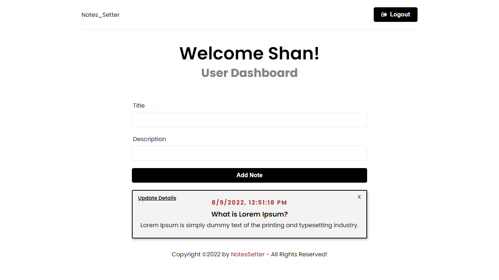

## NotesSetter MERN app



### If you are not using docker to install dependencies,

```
1. npm install
2. cd frontend
3. npm install
4. cd ..
### to run both backend and frontend once, from your root run this command
5. npm run dev
```

### If you are using docker,

```
ps: Still didn't configure docker to the app, will update this

```

### Live Preview

-  https://notes-setter.herokuapp.com/
-  Some sample data to test the app,
   -  Username: john@gmail.com
   -  Password: john123
